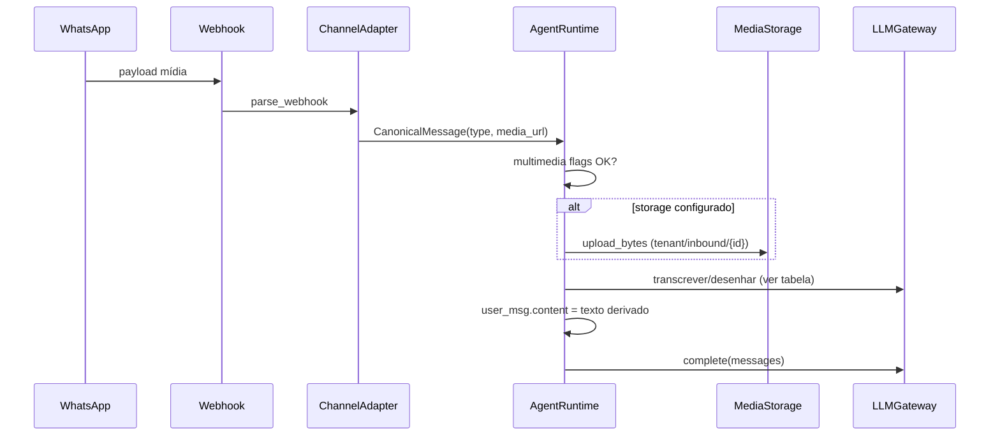

# FEAT-014 — Runtime de mídia (áudio / imagem)

> Implementado em 2026-06-01 (backend `feat(FEAT-014)`). Documento de referência para fase 2 (outbound).

## Contexto

- `CanonicalMessage` já suporta `type` (`text|audio|image|document`) e `media_url`.
- Adaptadores Z-API/Evolution em `parse_webhook` hoje **só** emitem `type=text` (ignoram mídia).
- `AgentRuntime` persiste `message.body` como string e envia só texto ao LLM.
- UI do editor (`multimedia.image`, `multimedia.audio`) já existe; flags não chegam ao runtime.
- **FEAT-017** entrega `core/storage/media.py` (R2/S3) para persistir binários inbound.

## Objetivos

1. Inbound: receber áudio/imagem no WhatsApp, normalizar, opcionalmente armazenar no R2, produzir **input textual** para o LLM.
2. Respeitar `AgentVersion.multimedia` (não processar tipo desabilitado; resposta educada ao usuário).
3. Outbound (fase 2, opcional neste epic): enviar mídia via `send_audio` / `send_image` quando tools `send_*_message` forem implementadas.

## Fluxo inbound (fase 1)



## Normalização nos adaptadores

| Provider | Detecção | `media_url` | `body` fallback |
|----------|----------|-------------|-----------------|
| Z-API | `audio`, `image`, `document` no payload | URL direta ou campo anexo | caption ou placeholder `[áudio]` |
| Evolution | `messageType` / nested `audioMessage`, `imageMessage` | `url` ou download via API interna | idem |

Implementar helpers `_extract_media(payload) -> tuple[type, url, caption]` por adapter.

## Tratamento no runtime

Novo módulo `core/runtime/media_input.py`:

```python
async def resolve_user_content(
    message: CanonicalMessage,
    multimedia: dict,
    *,
    tenant_id: str,
    storage: MediaStorage | None,
    openai_client: ...,
) -> str:
```

| type | multimedia | Comportamento |
|------|------------|---------------|
| text | * | `message.body` |
| image | `image: true` | Vision: imagem URL ou bytes → descrição curta + caption |
| image | `image: false` | Resposta fixa: "Este agente não aceita imagens." (sem LLM) |
| audio | `audio: true` | Whisper `audio/transcriptions` na URL/arquivo |
| audio | `audio: false` | Mensagem fixa educada |
| document | `document: true` | Fase 1.5: extrair texto se PDF; senão pedir resumo em texto |

**Créditos:** evento `media_transcribed` / `media_vision` em `UsageEvent` (0 créditos extra no MVP ou +1 por chamada — alinhar com billing).

## Persistência `Message`

- Manter `content` como texto enviado ao LLM (transcrição/descrição).
- Adicionar coluna opcional `media_metadata` JSON (`type`, `storage_key`, `original_url`) — migração `0009_message_media_metadata.py`.

## Dependências

- OpenAI: Whisper + modelo vision já na stack (`openai` SDK).
- FEAT-017: upload inbound; se `StorageNotConfiguredError`, usar `media_url` efêmera do provedor (TTL curto) com log `media_storage_skipped`.

## Testes (TDD)

1. Unit: `parse_webhook` Z-API/Evolution com fixtures JSON de áudio/imagem.
2. Unit: `resolve_user_content` com multimedia on/off (mocks OpenAI).
3. Integração: runtime grava `content` transcrito; não chama LLM se flag off.

## Fora de escopo (fase 1)

- Envio outbound de mídia pelo agente (tools `send_audio_message` / `send_image_message`).
- Vídeo, stickers, localização.
- FEAT-015 (Anthropic/Groq) para vision — só OpenAI na fase 1.

## Ordem de implementação sugerida

1. Migração `media_metadata` (opcional mas recomendada).
2. Parsers Z-API + Evolution.
3. `media_input.py` + testes.
4. Integrar em `AgentRuntime.process` antes de persistir `user_msg`.
5. Métricas/logs estruturados.

## Riscos

| Risco | Mitigação |
|-------|-----------|
| URL de mídia do WA expira | Upload R2 no início do processamento |
| Custo Whisper/vision | Gate por plano (futuro); log tokens |
| SSRF em `media_url` | Reutilizar `validate_external_url` antes de download |
